# Relatório de Análise - Características de Repositórios Populares do GitHub

**Disciplina**: Experimentação de Software  
**Instituição**: PUCMINAS  
**Período**: 01/2026  
**Autores**: Augusto Fuscaldi Cerezo, Filipe Faria Melo

---

## 1. Introdução

### 1.1 Contextualização

O GitHub é a maior plataforma de hospedagem de código-fonte do mundo, abrigando milhões de repositórios open-source. Repositórios com alto número de estrelas tendem a ser mais populares e amplamente utilizados pela comunidade. Entender as características desses sistemas populares pode fornecer insights valiosos sobre boas práticas de desenvolvimento, manutenção e gestão de projetos open-source.

### 1.2 Problema Foco do Experimento

Há um interesse sobre quais características técnicas e de manutenção são comuns entre os sistemas open-source mais populares. Questões sobre maturidade, frequência de atualização, linguagens utilizadas e gestão de contribuições externas permanecem sem respostas claras baseadas em dados empíricos.

### 1.3 Questões-Pesquisa

Este estudo busca responder as seguintes questões de pesquisa :

- **01**: Sistemas populares são maduros/antigos?
- **02**: Sistemas populares recebem muita contribuição externa?
- **03**: Sistemas populares lançam releases com frequência?
- **04**: Sistemas populares são atualizados com frequência?
- **05**: Sistemas populares são escritos nas linguagens mais populares?
- **06**: Sistemas populares possuem alto percentual de issues fechadas?
- **07**: Existe correlação entre linguagem de programação e métricas de contribuição/atualização?

### 1.4 Hipóteses

**H1**: Sistemas populares tendem a ser maduros, com idade superior a 5 anos, pois leva tempo para construir reputação e base de usuários.

**H2**: Sistemas populares recebem alta contribuição externa (mediana superior a 200 PRs aceitas), devido à visibilidade e interesse da comunidade.

**H3**: Sistemas populares possuem releases frequentes (mediana superior a 20 releases), indicando ciclos de desenvolvimento ativos e bem gerenciados.

**H4**: Sistemas populares são atualizados frequentemente, com mediana de tempo desde última atualização inferior a 15 dias.

**H5**: Sistemas populares utilizam linguagens mainstream como JavaScript, Python, Java, que possuem grandes comunidades.

**H6**: Sistemas populares possuem alto percentual de issues fechadas (mediana superior a 70%), indicando manutenção ativa e responsividade.

**H7**: Linguagens diferentes apresentam padrões distintos de contribuição e atualização, com linguagens de infraestrutura tendo mais releases que linguagens de aplicação.

### 1.5 Objetivos

**Objetivo Principal**: Caracterizar sistemas open-source populares através de análise empírica dos 1000 repositórios com maior número de estrelas no GitHub.

**Objetivos Específicos**:

- Coletar dados quantitativos sobre idade, contribuições, releases, atualizações, linguagens e issues
- Calcular estatísticas descritivas (média, mediana, mínimo, máximo) para cada métrica
- Identificar padrões e correlações entre linguagens de programação e métricas de desenvolvimento
- Validar ou refutar as hipóteses formuladas através de análise de dados
- Fornecer insights para decisões de gestão de projetos open-source

---

## 2. Metodologia

### 2.1 Passo a Passo do Experimento

**Etapa 1 - Planejamento**:

1. Definição das questões de pesquisa (01-07)
2. Identificação das métricas necessárias
3. Formulação de hipóteses

**Etapa 2 - Coleta de Dados**:

1. Autenticação na API GraphQL v4 do GitHub usando token de acesso
2. Query dos 1000 repositórios com maior número de estrelas
3. Paginação de 10 repositórios por requisição (100 requisições totais)
4. Delay de 2 segundos entre requisições para respeitar rate limiting
5. Sistema de retry com backoff exponencial (3 tentativas)
6. Armazenamento dos dados em estruturas Python (lista de dicionários)

**Etapa 3 - Processamento**:

1. Cálculo de métricas derivadas (idade em dias, dias desde último push, percentual de issues)
2. Agregação de estatísticas descritivas por métrica
3. Contagem de repositórios por linguagem
4. Análise estratificada por linguagem (top 5)

**Etapa 4 - Exportação**:

1. Geração de arquivo CSV com dados brutos e estatísticas
2. Organização dos resultados para análise

**Etapa 5 - Análise**:

1. Análise de valores medianos para cada RQ
2. Comparação com hipóteses formuladas
3. Identificação de padrões e outliers
4. Documentação de insights

### 2.2 Decisões Metodológicas

**Critério de Popularidade**: Número de estrelas foi escolhido como proxy de popularidade por ser uma métrica amplamente aceita e de fácil coleta.

**Tamanho da Amostra**: 1000 repositórios foram selecionados para balancear representatividade e viabilidade de coleta dentro dos limites da API.

**Métrica de Atualização**: Optou-se por `pushedAt` ao invés de `updatedAt`, pois este último é modificado por qualquer atividade (stars, forks), enquanto `pushedAt` reflete commits de código efetivos.

**Pull Requests**: Consideradas apenas PRs com estado `MERGED` para medir contribuições efetivamente aceitas.

**Issues**: Calculado percentual de fechamento para normalizar entre repositórios de tamanhos diferentes.

**Estatística Central**: Mediana foi escolhida como medida principal por ser robusta a outliers, comum em distribuições de dados de software.

### 2.3 Materiais Utilizados

**API**: GitHub GraphQL API v4

- Endpoint: `https://api.github.com/graphql`
- Autenticação: Token de acesso pessoal com permissão `public_repo`

**Linguagem de Programação**: Python 3.12

**Bibliotecas**:

- `requests`: Requisições HTTP para API GraphQL
- `csv`: Exportação de dados estruturados
- `datetime`: Cálculos temporais
- `tkinter`: Interface gráfica (GUI)
- `threading`: Processamento assíncrono na GUI

**Infraestrutura**:

- Sistema Operacional: Windows
- Conexão de internet estável
- Token válido do GitHub

### 2.4 Métodos Utilizados

**Coleta de Dados**: Query GraphQL parametrizada com cursor de paginação para navegação sequencial pelos resultados ordenados por estrelas.

**Tratamento de Erros**: Retry com backoff exponencial (1s, 2s, 4s) para lidar com timeouts e falhas de rede temporárias.

**Processamento Temporal**: Cálculo de diferença em dias entre data atual e timestamps ISO 8601 fornecidos pela API.

**Agregação Estatística**: Cálculo de média, mediana (percentil 50), mínimo e máximo usando funções Python nativas.

**Categorização**: Agrupamento de repositórios por linguagem primária para análise estratificada.

### 2.5 Métricas e suas Unidades

| Métrica                    | Unidade             | Descrição                                |
| -------------------------- | ------------------- | ---------------------------------------- |
| Idade do Repositório       | Dias                | Diferença entre data atual e `createdAt` |
| Pull Requests Aceitas      | Contagem            | PRs com estado `MERGED`                  |
| Total de Releases          | Contagem            | Número de releases publicadas            |
| Dias desde Último Push     | Dias                | Diferença entre data atual e `pushedAt`  |
| Linguagem Primária         | Categoria           | Linguagem com maior % de código          |
| Percentual Issues Fechadas | Percentual (0-100%) | (issues fechadas / total issues) × 100   |
| Número de Estrelas         | Contagem            | Total de stars do repositório            |

---

## 3. Visualização dos Resultados

### 3.1 Dados Coletados

Total de repositórios analisados: **1000**

### 3.2 Estatísticas Descritivas Gerais

#### RQ01: Idade dos Repositórios

| Estatística | Valor (dias) | Valor (anos) |
| ----------- | ------------ | ------------ |
| Média       | 2290         | ~6,27        |
| Mediana     | 3062         | ~8,39        |
| Mínimo      | 46           | ~0,126       |
| Máximo      | 6537         | ~17,9        |

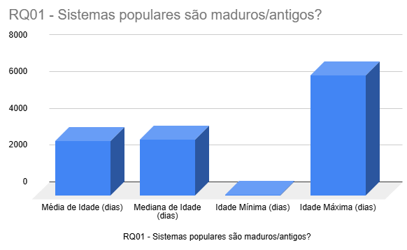

---

#### RQ02: Pull Requests Aceitas

| Estatística | Valor |
| ----------- | ----- |
| Média       | 3954  |
| Mediana     | 741   |
| Mínimo      | 0     |
| Máximo      | 94634 |

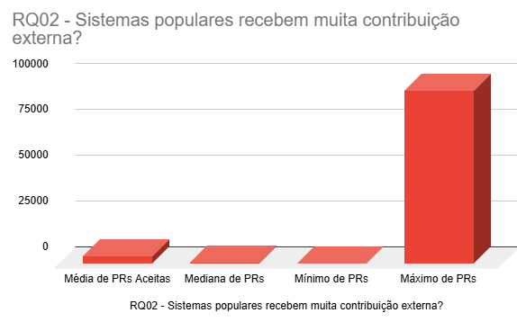

---

#### RQ03: Releases

| Estatística | Valor |
| ----------- | ----- |
| Média       | 120   |
| Mediana     | 41    |
| Mínimo      | 0     |
| Máximo      | 1000  |

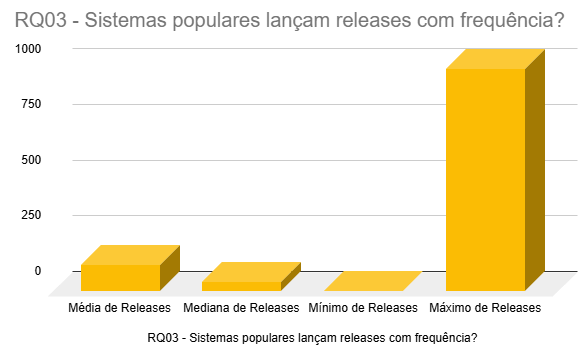

---

#### RQ04: Frequência de Atualização

| Estatística | Valor (dias desde último) |
| ----------- | ------------------------- |
| Média       | 111                       |
| Mediana     | 1                         |
| Mínimo      | 0                         |
| Máximo      | 2284                      |

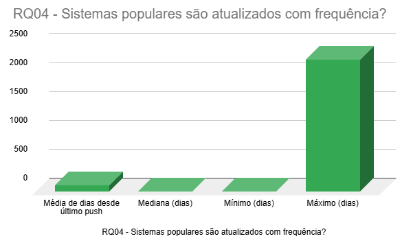

---

#### RQ05: Linguagens de Programação

**Top 10 Linguagens**:

| Posição | Linguagem        | Repositórios | Percentual |
| ------- | ---------------- | ------------ | ---------- |
| 1       | Python           | 200          | 20,00%     |
| 2       | Typescrypt       | 160          | 16,00%     |
| 3       | Javascrypt       | 115          | 11,50%     |
| 4       | N/A              | 95           | 9,50%      |
| 5       | Go               | 77           | 7,70%      |
| 6       | Rust             | 54           | 5,40%      |
| 7       | Java             | 47           | 4,70%      |
| 8       | C++              | 46           | 4,60%      |
| 9       | C                | 25           | 2,50%      |
| 10      | Jupyter Notebook | 23           | 2,30%      |

\*NOTA - Os percentuais mostrados na imagem são apenas dos top 10, enquanto os que mostram na tabela é o percentual em relação a TODAS as linguagens dos 1000 repos.

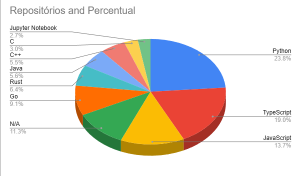

---

#### RQ06: Percentual de Issues Fechadas

| Estatística | Valor (%) |
| ----------- | --------- |
| Média       | 77,25%    |
| Mediana     | 86,8%     |
| Mínimo      | 0%        |
| Máximo      | 100%      |

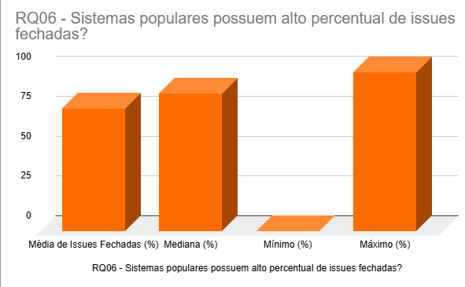

---

### 3.3 Análise por Linguagem (RQ07)

#### Top 5 Linguagens - Comparação de Métricas

**Linguagem 1: Python**

Total de Repositórios: 200

| Métrica         | Média | Mediana |
| --------------- | ----- | ------- |
| PRs Aceitas     | 4059  | 641     |
| Releases        | 92    | 24      |
| Dias desde Push | 121   | 2       |

**Linguagem 2: TypeScript**

Total de Repositórios: 160

| Métrica         | Média | Mediana |
| --------------- | ----- | ------- |
| PRs Aceitas     | 5023  | 2584    |
| Releases        | 256   | 158     |
| Dias desde Push | 34    | 0       |

**Linguagem 3: JavaScript**

Total de Repositórios: 115

| Métrica         | Média | Mediana |
| --------------- | ----- | ------- |
| PRs Aceitas     | 2143  | 576     |
| Releases        | 110   | 40      |
| Dias desde Push | 151   | 4       |

**Linguagem 4: N/A**

Total de Repositórios: 95

| Métrica         | Média | Mediana |
| --------------- | ----- | ------- |
| PRs Aceitas     | 1331  | 129     |
| Releases        | 2     | 0       |
| Dias desde Push | 248   | 129     |

**Linguagem 5: Go**

Total de Repositórios: 77

| Métrica         | Média | Mediana |
| --------------- | ----- | ------- |
| PRs Aceitas     | 6053  | 1690    |
| Releases        | 180   | 132     |
| Dias desde Push | 48    | 0       |

---

## 4. Discussão dos Resultados

### 4.1 RQ01: Maturidade dos Sistemas Populares

**Hipótese**: Sistemas populares tendem a ser maduros, com idade superior a 5 anos (1825 dias).

**Resultado Observado**: A mediana de idade foi de 3062 dias (8,39 anos).

**Análise**:

Confirmado, grande parte dos sistemas populares tem idade superior a 5 anos, com poucos exemplos abaixo de 5 e menos ainda abaixo de 1 ano de idade. Isso demonstra como os repos populares já tem alta maturidade, conhecimento e tempo na área.

---

### 4.2 RQ02: Contribuição Externa

**Hipótese**: Sistemas populares recebem alta contribuição externa (mediana superior a 200 PRs aceitas).

**Resultado Observado**: A mediana de PRs aceitas foi de 741.

**Análise**:

Hipotese confirmada, foi observado que, em geral nas repos, há alto indice de PRs, facilmente ultrapassando nossa estipulação inicial. Existe, no entanto, alguns outliers, há algumas que não houveram PRs, e outras que tiveram dezenas de milhares (chegando até em 94634 !), isso demonstra que, projetos que tem abertura para contribuições, em geral, tendem a ser mais populares.

---

### 4.3 RQ03: Frequência de Releases

**Hipótese**: Sistemas populares possuem releases frequentes (mediana superior a 20 releases).

**Resultado Observado**: A mediana de releases foi de 41.

**Análise**:

Por hora, diremos que nossa hipotese está correta, porém com um pequeno detalhe.
Percebeu-se que repos que utilizam linguagens de programação (python, javascrypt, go...) tem altos níveis de releases, facilmente chegando á ou superando 50 releases, porém, para lrepos mais focadas em documentação não há quase nenhuma release, com maioria dos projetos de documentação (N/A) tendo 0 releases. Isso nos mostra que, para aplicações e bibliotecas, há alto versionamento, o que faz sentido dado que sabemos que a idade média (e mediana) dos repos populares são altas, porém isso não tende a se estender para repos de documentação.

---

### 4.4 RQ04: Frequência de Atualização

**Hipótese**: Sistemas populares são atualizados frequentemente, com mediana inferior a 15 dias desde último push.

**Resultado Observado**: A mediana foi de 1 dias desde último push.

**Análise**:

Dado os resultados observados daremos essa hipótese como confirmada. Grande maioria dos projetos estão bem ativos, com dias desde ultimo push variando entre 0 e 5 dias, porém, ainda há projetos que estão altamente inativos, percebe-se que há uma quantia baixa porém visível de repositórios com 100+ dias de inatividade, e uma quantidade ainda menor com mais de 300.
Seria interessante pesquisar mais a fundo para ver se os repositórios inativos estão dessa forma por abandono ou se já chegaram em sua "versão final".

---

### 4.5 RQ05: Linguagens de Programação

**Hipótese**: Sistemas populares utilizam linguagens mainstream como JavaScript, Python, Java.

**Resultado Observado**: As 5 linguagens mais frequentes foram: Python, Typescrypt, Javascrypt, N/A, Go.

**Análise**:

Hipotese confirmada. Embora haja uma dominancia do Python, typescrypt e javascrypt ainda é possível ver como o github é utilizado com outras linguagens ou de outras formas, GO e projetos de documentação (N/A) estão no top 5, isso sem contar os projetos que foram labeled como MD (ao invés de N/A). Outras linguágens notáveis foram Rust, Java, C++, C e Jupyter Notebook, que juntos formam 19,5% de todos os repositórios analisados.

---

### 4.6 RQ06: Gestão de Issues

**Hipótese**: Sistemas populares possuem alto percentual de issues fechadas (mediana superior a 70%).

**Resultado Observado**: A mediana do percentual de issues fechadas foi de 86.8%.

**Análise**:

Considerando nossos resultados, é facil concluir que nossa hipotese foi confirmada. Maioria dos repositórios tem 77% ou mais de issues fechadas, com nossos outliers sendo as repos que simplesmente não abriram issues ou que não resolveram muitas de suas issues abertas, mas a quantia dessas é bem baixa. Isso nos mostra que os projetos populares resolvem maioria de suas issues, provavelmente porque eles tem tantos que possam depender de suas aplciações e também tendo um alto numero de contribuidores ajuda a encontrar e resolver os issues. Uma alta maturidade também é importante citar como um dos fatores do alto percentual de issues fechadas.

---

### 4.7 RQ07: Análise Comparativa por Linguagem

**Hipótese**: Linguagens diferentes apresentam padrões distintos de contribuição e atualização.

**Resultado Observado**:

Há similaridades entre:

Python/Javascrypt -> Similares nos tempos para push, media/mediana de releases e media/mediana de PRs (também nesse com o GO)

Typescrypt/Go -> Similares nos tempos para push, media/mediana de releases.

Documentação é outlier, uma vez que tem tempos longos para push, quase nunca tem release e possuem baixas PRs

### Gráficos Comparativos

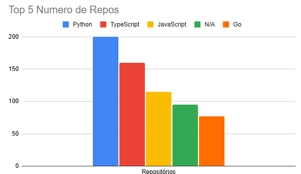
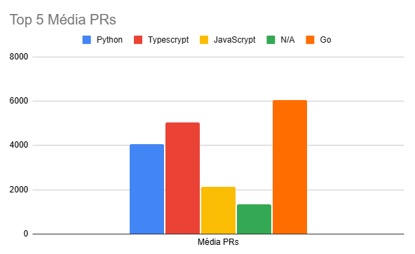
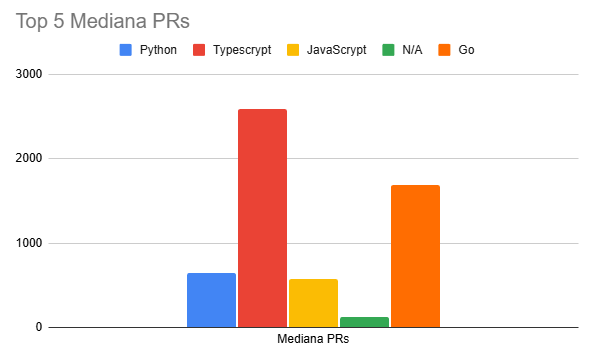
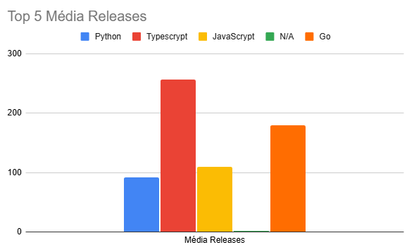
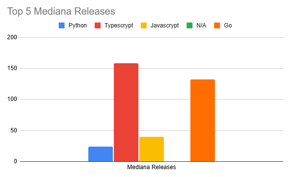
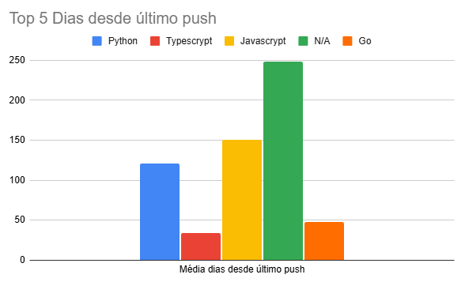
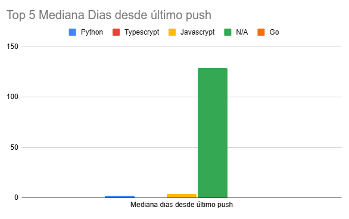

---

**Limitações do Estudo**:

1. **Viés de Seleção**: Apenas repositórios públicos do GitHub foram analisados, excluindo projetos em outras plataformas ou privados.

2. **Métrica de Popularidade**: Número de estrelas pode não refletir uso efetivo ou qualidade técnica.

3. **Snapshot Temporal**: Dados coletados em um único momento não capturam evolução temporal.

4. **Categorização de Linguagem**: Linguagem primária pode não representar linguagens secundárias importantes no projeto.

5. **Contexto de Domínio**: Não foi considerado o domínio de aplicação (web, mobile, ML, infraestrutura), que pode influenciar métricas.

---

### 5. Conclusão

**Introdução**

A análise dos 1.000 repositórios mais estrelados do GitHub revelou um conjunto consistente de características que permitem responder às questões de pesquisa propostas e validar a maioria das hipóteses iniciais. Em termos de maturidade, os repositórios são, em média, antigos: a mediana de idade é de 3.062 dias (por volta de 8,4 anos), o que confirma que projetos populares tendem a acumular reputação ao longo de vários anos. Quanto à contribuição externa, observou-se uma mediana de 741 pull requests aceitos por repositório, indicando um nível elevado de colaboração comunitária. Os repositórios também apresentam versionamento significativo: a mediana de releases é 41, acima do valor de comparação de 20 releases. Em relação à manutenção e atividade de desenvolvimento, os projetos são atualizados com muita frequência. A mediana de dias desde o último push é 1 dia, o que confirma uma base de código amplamente ativa.

---

**Linguagens de Programação**

A distribuição por linguagens mostra predominância de: 

| Linguagem | % dos repositórios |
|---|---|
| Python | 20% |
|TypeScript|16%|
|JavaScript|11,5%|
|Go|7,7%|
|Diversos|44,8%|

Observou-se ainda que repositórios categorizados como documentação (N/A) compõem uma fração relevante e têm comportamento diferente dos outros, apresentando poucas releases e maior inatividade. A observação dos objetivos almejados pelo repositório deve ser levada em consideração quando se está fazenod uma análise estatística.

---
**Resumo**

Por fim, os resultados devem ser interpretados com cautela devido a limitações conhecidas: seleção por estrelas, análise em um único snapshot temporal e categorização por linguagem primária. Ainda assim, os dados fornecem evidências robustas de que repositórios mais estrelados no GitHub tendem a ser projetos consolidados, colaborativos e bem mantidos.

---

### 5.1 Tomada de Decisão

**Decisões Chave**
- Popularidade: usar número de estrelas como proxy.
- Amostra: analisar top 1.000 repositórios.
- Atualização: medir com pushedAt.
- Contribuições: contar somente PRs MERGED.
- Métrica central: usar mediana.
- Coleta: delay 2s, retry com backoff e salvamento parcial.
- Ferramenta/saída: Python 3.12 + requests, exportar CSV, GUI com tkinter/threading.

---

### 5.2 Sugestões Futuras

**Dados Adicionais**

- Contribuidores: coletar total de contribuidores, novos contribuidores por mês e métricas de retenção.

- Atividade de commits: commits por período, churn (linhas adicionadas/removidas) e tamanho médio de PR.

- Qualidade de código: cobertura de testes, taxa de sucesso de CI, métricas de lint e complexidade.

**Novos Indicadores**

- Taxa de aceitação de PRs: PRs MERGED / PRs abertos.

- Cadência de releases: tempo médio entre releases, releases por ano, aderência ao versionamento semântico.

- Metodologia e Reprodutibilidade

- Coleta longitudinal: salvar snapshots periódicos e usar coletas agendadas para análises de tendência.

- Exportação rica: além de CSV, exportar JSON com metadados da query e timestamp da coleta.

**Coletas**

- Aumentar o número de repositórios coletados, gerando uma amostra mais precisa e significativa.

- Utilizar métrica parametrizável ao invés de apenas por número de estrelas. Gerando dados com diversos parâmetros.
