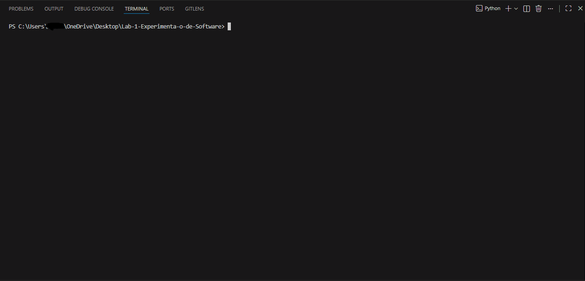
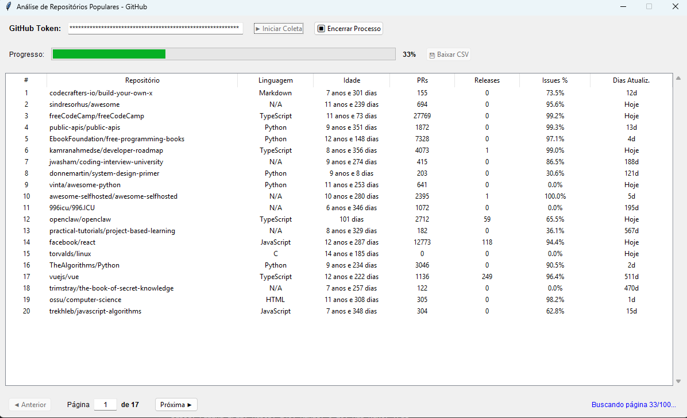
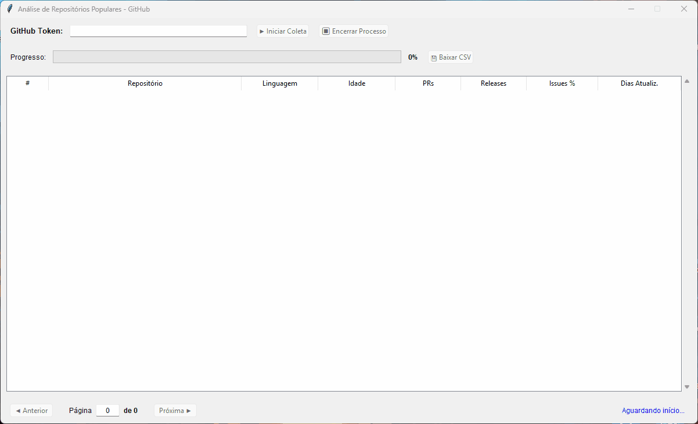
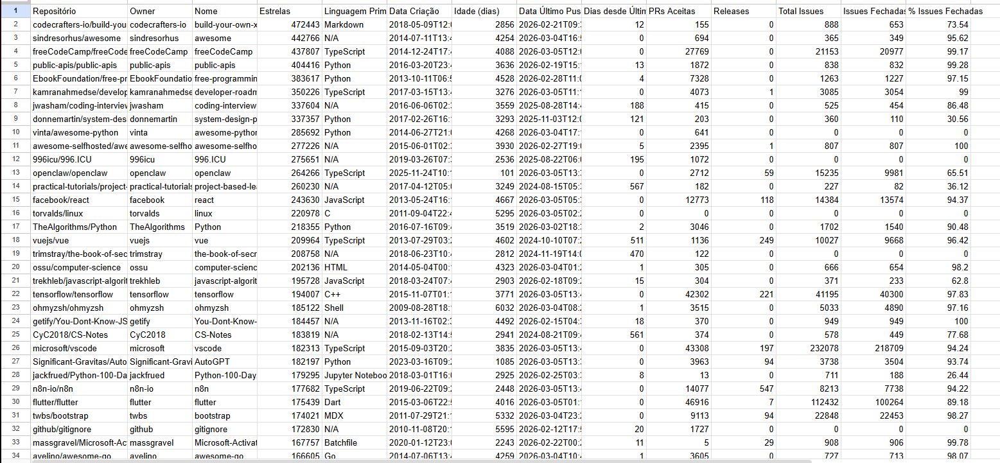
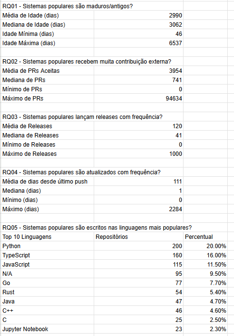
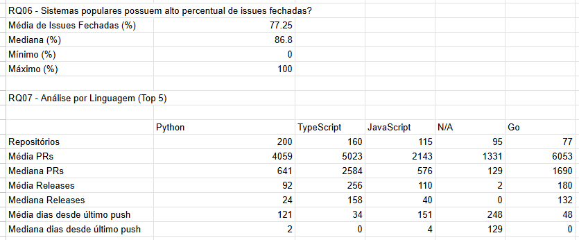

# Análise de Repositórios Populares do GitHub

Sistema desenvolvido para o Laboratório de Experimentação de Software - PUCMINAS 01/2026

## Visão Geral

Este projeto coleta e analisa dados dos 1000 repositórios mais populares do GitHub para responder questões de pesquisa (RQ01-RQ07) sobre características de sistemas open-source populares.

## Questões de Pesquisa

O sistema responde as seguintes questões:

- **RQ01**: Sistemas populares são maduros/antigos?
- **RQ02**: Sistemas populares recebem muita contribuição externa?
- **RQ03**: Sistemas populares lançam releases com frequência?
- **RQ04**: Sistemas populares são atualizados com frequência?
- **RQ05**: Sistemas populares são escritos nas linguagens mais populares?
- **RQ06**: Sistemas populares possuem alto percentual de issues fechadas?
- **RQ07**: Análise comparativa por linguagem (PRs, releases, atualizações)

## Arquitetura do Sistema

### Módulos

```
Lab-1-Experimentação-de-Software/
├── github_utils.py          # Módulo compartilhado com funções reutilizáveis
├── collect_github_data.py   # Interface CLI (linha de comando)
├── github_analyzer_gui.py   # Interface gráfica (GUI)
├── RELATORIO.md             # Relatório de comparação e medição, conforme requisitado da disciplina
└── README.md                # Este arquivo
```

### Módulo Compartilhado (github_utils.py)

Centraliza toda a lógica comum entre CLI e GUI:

**Funções principais:**

- `fetch_repositories()` - Requisições GraphQL com retry automático
- `calculate_age_in_days()` - Calcula idade do repositório
- `calculate_days_since_push()` - Dias desde último commit
- `calculate_closed_issues_ratio()` - Percentual de issues fechadas
- `validate_token()` - Valida token do GitHub
- `export_to_csv()` - Exporta dados e estatísticas para CSV
- `format_age()` - Formata dias em anos/meses/dias

**Configurações:**

- GraphQL query completa para coletar dados
- URL da API do GitHub
- Timeout configurado: 10s (connect) + 30s (read)
- Retry automático: 3 tentativas com backoff exponencial

## Instalação e Requisitos

### Dependências

```bash
pip install requests
```

Nota: `tkinter` já vem instalado com Python (biblioteca padrão)

### Token do GitHub

1. Acesse https://github.com/settings/tokens
2. Clique em "Generate new token (classic)"
3. Selecione permissão `public_repo`
4. Copie o token gerado

## Como Usar

### Interface CLI (Linha de Comando)

Execute no terminal:

```bash
python collect_github_data.py
```

**Funcionalidades:**

- Coleta automática de 1000 repositórios (paginação de 10 itens)
- Exibição em tempo real dos dados coletados
- Estatísticas detalhadas no console (RQ01-RQ07)
- Opção de exportar dados para CSV ao finalizar

**Dados exibidos:**

- Tabela com repositórios, linguagem, idade, PRs, releases, issues
- Estatísticas gerais (médias, medianas, mínimos, máximos)
- Top 10 linguagens mais usadas
- Análise detalhada por linguagem (top 5)



### Interface GUI (Gráfica)

Execute no terminal:

```bash
python github_analyzer_gui.py
```

**Funcionalidades:**

1. **Entrada de Token**
   - Campo seguro com asteriscos
   - Validação automática ao iniciar coleta

2. **Coleta de Dados**
   - Botão "Iniciar Coleta"
   - Botão "Encerrar Processo" (para parar antes dos 1000)
   - Barra de progresso em tempo real
   - Status detalhado da operação

3. **Visualização de Dados**
   - Tabela com 20 repositórios por página (50 páginas total)
   - Colunas: #, Repositório, Linguagem, Idade, PRs, Releases, Issues%, Dias desde Push
   - Navegação com botões Anterior/Próxima
   - Campo de entrada para ir direto a uma página específica

4. **Exportação**
   - Botão "Baixar CSV" (habilitado após coleta)
   - Diálogo para escolher local e nome do arquivo
   - Inclui todos os dados coletados + estatísticas dos RQs

**Características Técnicas:**

- Interface não trava durante coleta (threading)
- Atualização em tempo real da tabela
- Preserva dados parciais em caso de erro/interrupção
- Validação de entrada para navegação de páginas

 

## Formato de Dados Coletados

### Dados por Repositório (14 colunas)

1. Repositório (owner/name)
2. Owner
3. Nome
4. Estrelas
5. Linguagem Primária
6. Data Criação
7. Idade (dias)
8. Data Último Push
9. Dias desde Último Push
10. PRs Aceitas
11. Releases
12. Total Issues
13. Issues Fechadas
14. % Issues Fechadas

### Estatísticas no CSV

Após os dados dos repositórios, o CSV inclui automaticamente:

- **RQ01**: Média, mediana, mínimo e máximo de idade
- **RQ02**: Estatísticas de PRs aceitas
- **RQ03**: Estatísticas de releases
- **RQ04**: Estatísticas de dias desde último push
- **RQ05**: Top 10 linguagens com contagem e percentual
- **RQ06**: Estatísticas de percentual de issues fechadas
- **RQ07**: Análise detalhada por linguagem (top 5)

  

## Detalhes Técnicos

### API do GitHub

**Requisições:**

- GraphQL API v4
- Paginação: 10 itens por requisição (100 requisições para 1000 repos)
- Rate limiting: 2 segundos entre requisições
- Timeout: 10s conexão + 30s leitura

**Query GraphQL:**
Busca repositórios com mais estrelas coletando:

- Metadados (nome, owner, datas, estrelas)
- Linguagem primária
- Pull requests com estado MERGED
- Releases totais
- Issues totais e fechadas

### Tratamento de Erros

**Retry Automático:**

- 3 tentativas em caso de falha
- Backoff exponencial: 1s → 2s → 4s
- Preserva dados já coletados

**Tipos de Erro Tratados:**

- Timeout de conexão
- Erros de rede
- Token inválido
- Rate limiting
- Erros GraphQL

**Coleta Parcial:**

- Sistema salva dados coletados até o momento de falha
- Permite exportar dados parciais para CSV
- GUI exibe quantidade de repositórios coletados

### Cálculos Importantes

**Diferença: updatedAt vs pushedAt**

- `updatedAt`: Atualizado com QUALQUER atividade (stars, forks, issues)
- `pushedAt`: Atualizado apenas com commits de código
- Sistema usa `pushedAt` para RQ04 (frequência de atualização de código)

**Idade do Repositório:**

```python
idade_dias = (data_atual - data_criacao).days
```

**Percentual de Issues Fechadas:**

```python
if total_issues == 0: return 0.0
return (issues_fechadas / total_issues) * 100
```

## Resolução de Problemas

### Timeout de Conexão

**Sintoma:** `Max retries exceeded` ou `Connection timed out`

**Causas Comuns:**

- Conexão instável com internet
- Firewall/Antivírus bloqueando Python
- VPN interferindo
- Proxy corporativo

**Soluções:**

1. Verificar conectividade:

```powershell
ping api.github.com
Test-NetConnection api.github.com -Port 443
```

2. Aumentar timeout no `github_utils.py` (linha ~140):

```python
timeout=(15, 60)  # em vez de (10, 30)
```

3. Aumentar intervalo entre requisições:

```python
time.sleep(5)  # em vez de 2
```

4. Verificar status da API: https://www.githubstatus.com/

### Token Inválido

**Sintoma:** Mensagem "Token inválido"

**Soluções:**

- Verificar se copiou token completo (começando com `ghp_` ou `github_pat_`)
- Confirmar permissão `public_repo` no token
- Gerar novo token se expirado

### Interface Travada

A GUI usa threading, mas pode demorar. Aguarde conclusão ou use botão "Encerrar Processo".

### Página Inválida

O campo de navegação valida entrada:

- Aceita apenas números positivos
- Verifica se página existe (1 a total de páginas)
- Mostra mensagem de erro se inválido

## Performance

**Tempo de Coleta:**

- 1000 repositórios: aproximadamente 3-4 minutos
- 100 requisições × 2 segundos = ~3min20s (ideal)
- Pode variar conforme latência da rede

**Uso de Memória:**

- ~50MB para 1000 repositórios em memória
- Estrutura de dados: lista de dicionários JSON

**Display:**

- GUI: 20 itens por página (50 páginas)
- CLI: 10 itens por tela, navegação manual

### Testabilidade

Funções isoladas em `github_utils.py` permitem:

- Testes unitários independentes
- Validação de cálculos de data
- Mock de requisições HTTP
- Teste de lógica sem fazer requisições reais

## Limitações Conhecidas

1. **Rate Limiting:** GitHub limita requisições da API
   - Solução: Delay de 2s entre requisições

2. **Timeout:** Redes lentas podem causar timeouts
   - Solução: Retry automático + dados parciais

3. **Tamanho de Página:** Páginas muito grandes (>20 itens) podem dar bad gateway
   - Solução: Mantido em 10 itens por requisição

4. **Repositórios Privados:** Não são incluídos na busca
   - Query busca apenas repositórios públicos

## Melhorias Futuras

- Cache local de requisições
- Modo de retomar coleta interrompida
- Gráficos e visualizações na GUI
- Exportar para múltiplos formatos (JSON, Excel)
- Filtros avançados na visualização
- Comparação temporal (análises em diferentes datas)

## Licença

Projeto acadêmico - PUCMINAS 2026

## Autores

Augusto Fuscaldi Cerezo - Queries, funções do utils, code review.

Filipe Faria Melo - README, GUI, dados, imagens e code reviews.

Relatório realizado pelos dois membros em conferência.

Desenvolvido para a disciplina de Experimentação de Software
