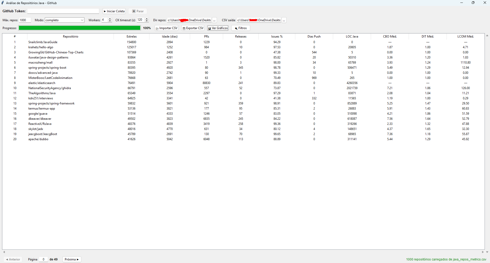
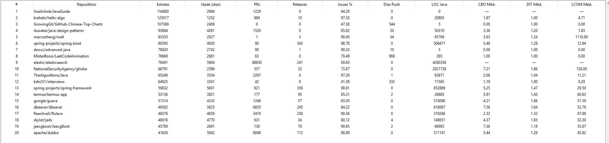
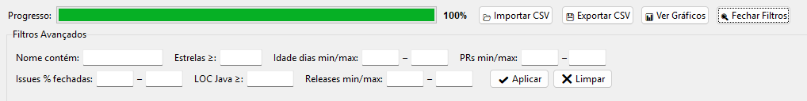
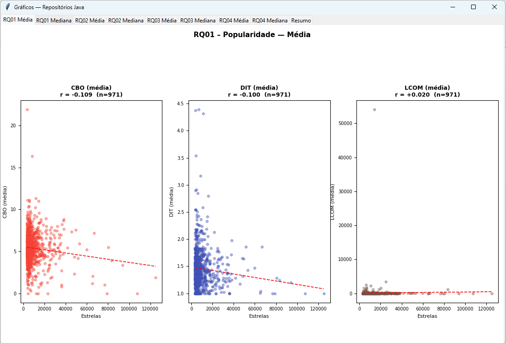
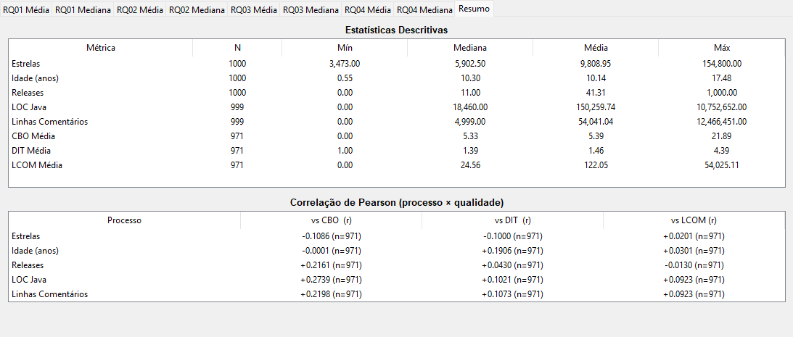

# Análise de Qualidade de Repositórios Java Populares

Sistema desenvolvido para o Laboratório de Experimentação de Software - PUCMINAS 01/2026

## Visão Geral

Este projeto estende o coletor do Trabalho 1 para focar nos 1000 repositórios Java mais populares do GitHub, combinando métricas de processo (popularidade, maturidade, atividade, tamanho) com métricas de produto de qualidade de código (CBO, DIT, LCOM) extraídas via ferramenta CK.

## Questões de Pesquisa

O sistema coleta dados para responder as seguintes questões:

- **RQ01**: Qual a relação entre a popularidade dos repositórios e as suas características de qualidade?
- **RQ02**: Qual a relação entre a maturidade dos repositórios e as suas características de qualidade?
- **RQ03**: Qual a relação entre a atividade dos repositórios e as suas características de qualidade?
- **RQ04**: Qual a relação entre o tamanho dos repositórios e as suas características de qualidade?

As características de qualidade analisadas são as métricas extraídas pela ferramenta CK: **CBO** (acoplamento entre objetos), **DIT** (profundidade de herança) e **LCOM** (falta de coesão dos métodos).

## Arquitetura do Sistema

### Módulos

```
trab-2/
├── github_utils.py              # Módulo compartilhado com funções reutilizáveis
├── collect_java_data.py         # Interface CLI (linha de comando)
├── ck/
│   └── ck-0.7.1-SNAPSHOT-jar-with-dependencies.jar  # Ferramenta CK
└── README.md                    # Este arquivo
```

### Módulo Compartilhado (github_utils.py)

Centraliza toda a lógica de coleta e análise:

**Funções principais:**

- `fetch_repositories()` — Requisições GraphQL com filtro `language:Java`
- `run_git_clone()` — Sparse checkout (apenas `.java`) com suporte a caminhos longos
- `count_java_loc()` — Contagem de linhas de código Java
- `run_ck_for_repo()` — Executa o CK e extrai médias/medianas de CBO, DIT e LCOM
- `calculate_age_in_days()` — Calcula idade do repositório
- `calculate_days_since_push()` — Dias desde último commit
- `calculate_closed_issues_ratio()` — Percentual de issues fechadas
- `validate_token()` — Valida token do GitHub
- `write_results_csv()` — Exporta métricas de processo e produto para CSV
- `write_list_csv()` — Exporta lista de repositórios sem métricas CK

**Configurações:**

- GraphQL query filtrada para `language:Java`
- Sparse checkout: baixa apenas arquivos `.java` (evita nomes longos no Windows)
- Timeout configurado: 10s (connect) + 30s (read)
- Retry automático: 3 tentativas com backoff exponencial

## Instalação e Requisitos

### Dependências

```bash
pip install requests
```

**Ferramentas externas:**

- `git` no PATH — para clonagem dos repositórios
- `java` no PATH — para execução do CK

O JAR do CK (`ck-0.7.1-SNAPSHOT-jar-with-dependencies.jar`) já está incluído na pasta `ck/`.

### Token do GitHub

1. Acesse https://github.com/settings/tokens
2. Clique em "Generate new token (classic)"
3. Selecione permissão `public_repo`
4. Copie o token e insira no topo de `collect_java_data.py`:

```python
GITHUB_TOKEN = "seu_token_aqui"
```

## Como Usar

### Interface Gráfica (GUI)

```bash
pip install matplotlib
python collect_java_gui.py
```

> **Dependências adicionais:** `matplotlib` e `numpy` para os gráficos.

---

#### Visão Geral da Interface



A janela principal é dividida em quatro áreas:

1. **Barra de Token** — campo para o GitHub Token (mascarado) e botões de controle
2. **Barra de Opções** — configurações de coleta
3. **Barra de Progresso** — acompanhamento em tempo real e ações pós-coleta
4. **Tabela de Repositórios** — exibição paginada dos dados coletados

---

#### Campos e Botões

**Barra de Token**

| Elemento         | Descrição                                                                                                                                |
| ---------------- | ---------------------------------------------------------------------------------------------------------------------------------------- |
| GitHub Token     | Cole aqui seu token pessoal do GitHub (`ghp_...`). O campo é mascarado. O botão **▶ Iniciar Coleta** só é habilitado após preenchimento. |
| ▶ Iniciar Coleta | Valida o token e inicia a coleta em background.                                                                                          |
| ⏹ Parar          | Sinaliza a thread para encerrar após a operação em andamento terminar. Os dados já coletados são preservados.                            |

**Barra de Opções**

| Campo          | Descrição                                                                                                             |
| -------------- | --------------------------------------------------------------------------------------------------------------------- |
| Máx. repos     | Quantidade máxima de repositórios a coletar (padrão: 1000).                                                           |
| Modo           | `completo` — clona e mede LOC/CK. `sem_clone` — apenas dados da API. `apenas_listar` — lista simples sem métricas CK. |
| Workers        | Número de threads paralelas para clone + CK (recomendado: 4).                                                         |
| CK timeout (s) | Tempo máximo para o CK processar um repositório antes de ser ignorado (padrão: 120s).                                 |
| Dir repos      | Pasta onde os clones temporários são armazenados durante a coleta (removidos após cada repo).                         |

**Barra de Progresso**

| Botão           | Descrição                                                                                                                           |
| --------------- | ----------------------------------------------------------------------------------------------------------------------------------- |
| 📂 Importar CSV | Carrega um CSV gerado anteriormente diretamente na tabela, sem precisar rodar nova coleta. Útil para análise e geração de gráficos. |
| 💾 Exportar CSV | Salva os dados exibidos na tabela (ou filtrados) em um arquivo CSV.                                                                 |
| 📊 Ver Gráficos | Abre a janela de gráficos das quatro questões de pesquisa. Habilitado após dados disponíveis.                                       |
| 🔍 Filtros      | Exibe/oculta o painel de filtros avançados.                                                                                         |

---

#### Tabela de Repositórios



Exibe os repositórios em páginas de 20 linhas. Clique em qualquer cabeçalho de coluna para ordenar.

| Coluna       | Descrição                               |
| ------------ | --------------------------------------- |
| #            | Posição na coleta (rank por estrelas)   |
| Repositório  | `owner/nome` do repositório             |
| Estrelas     | Número de estrelas (popularidade)       |
| Idade (dias) | Dias desde a criação do repositório     |
| PRs          | Total de pull requests aceitos (merged) |
| Releases     | Total de releases publicadas            |
| Issues %     | Percentual de issues fechadas           |
| Dias Push    | Dias desde o último push                |
| LOC Java     | Linhas de código Java (tamanho)         |
| CBO Méd.     | Média de CBO entre todas as classes     |
| DIT Méd.     | Média de DIT entre todas as classes     |
| LCOM Méd.    | Média de LCOM entre todas as classes    |

Colunas de métricas CK (`LOC Java`, `CBO`, `DIT`, `LCOM`) aparecem como `—` quando a coleta foi feita no modo `sem_clone` ou quando o CK falhou/deu timeout naquele repositório.

---

#### Filtros Avançados



Todos os campos são opcionais e podem ser combinados. Ao clicar em **✔ Aplicar**, a tabela exibe apenas os repositórios que satisfazem todos os critérios. **✖ Limpar** remove todos os filtros ativos.

---

#### Janela de Gráficos



Acessada pelo botão **📊 Ver Gráficos**. Organizada em abas:

| Aba          | Conteúdo                                                                     |
| ------------ | ---------------------------------------------------------------------------- |
| RQ01 Média   | Popularidade (estrelas) × CBO / DIT / LCOM — usando médias por repositório   |
| RQ01 Mediana | Popularidade (estrelas) × CBO / DIT / LCOM — usando medianas por repositório |
| RQ02 Média   | Maturidade (idade em anos) × CBO / DIT / LCOM — médias                       |
| RQ02 Mediana | Maturidade (idade em anos) × CBO / DIT / LCOM — medianas                     |
| RQ03 Média   | Atividade (releases) × CBO / DIT / LCOM — médias                             |
| RQ03 Mediana | Atividade (releases) × CBO / DIT / LCOM — medianas                           |
| RQ04 Média   | Tamanho (LOC + comentários) × CBO / DIT / LCOM — médias                      |
| RQ04 Mediana | Tamanho (LOC + comentários) × CBO / DIT / LCOM — medianas                    |
| Resumo       | Estatísticas descritivas e tabela de correlação de Pearson cruzada           |

---

#### Entendendo os Gráficos de Dispersão


Cada gráfico de dispersão mostra a relação entre uma **métrica de processo** (eixo X) e uma **métrica de qualidade** (eixo Y). Cada ponto representa um repositório.

**Elementos visuais:**

- **Pontos coloridos** — cada ponto é um repositório
- **Linha tracejada vermelha** — linha de regressão linear (tendência geral)
- **`r = +0.274`** — coeficiente de correlação de Pearson (detalhado abaixo)
- **`n = 971`** — número de repositórios com dados válidos para aquele par de métricas (pode ser menor que 1000 se houve falhas de clone ou timeout do CK)

**Abas Média vs. Mediana:**

Cada RQ tem duas abas — uma com a **média** e outra com a **mediana** das métricas CK por repositório. A comparação entre as duas serve para identificar **outliers**:

- Se a linha de tendência das duas abas for similar → os outliers têm pouco impacto
- Se as linhas divergirem bastante → outliers estão distorcendo a média (a mediana é mais confiável nesses casos)

---

#### Correlação de Pearson (r)

O valor `r` exibido no título de cada gráfico é o **coeficiente de correlação de Pearson**, que mede o grau e a direção de uma relação linear entre duas variáveis. Seu valor varia sempre entre **-1** e **+1**:

| Valor de \|r\| | Interpretação          |
| -------------- | ---------------------- |
| 0.00 – 0.19    | Correlação desprezível |
| 0.20 – 0.39    | Correlação fraca       |
| 0.40 – 0.59    | Correlação moderada    |
| 0.60 – 0.79    | Correlação forte       |
| 0.80 – 1.00    | Correlação muito forte |

O **sinal** indica a direção:

- **Positivo (+)** — quando X aumenta, Y tende a aumentar também
- **Negativo (−)** — quando X aumenta, Y tende a diminuir

> **Importante:** correlação não implica causalidade. Um `r` próximo de zero apenas indica ausência de relação _linear_ — pode existir uma relação não-linear não capturada pelo índice.

---

#### Aba Resumo



Contém duas tabelas:

**Estatísticas Descritivas** — para cada métrica coletada, exibe: quantidade de repos com dado válido, valor mínimo, mediana, média e máximo.

**Correlação de Pearson (processo × qualidade)** — tabela cruzada mostrando o `r` de cada métrica de processo (estrelas, idade, releases, LOC, comentários) contra cada métrica de qualidade (CBO, DIT, LCOM), com o `n` de cada par.

---

### Interface CLI (Linha de Comando)

```bash
python collect_java_data.py
```

**Argumentos disponíveis:**

| Argumento      | Padrão                   | Descrição                                                     |
| -------------- | ------------------------ | ------------------------------------------------------------- |
| `--max`        | 1000                     | Número máximo de repositórios                                 |
| `--per-page`   | 10                       | Itens por página (máx. 100)                                   |
| `--repos-dir`  | `repos`                  | Diretório para clones temporários                             |
| `--output`     | `java_repos_metrics.csv` | Arquivo CSV de saída                                          |
| `--skip-clone` | —                        | Não clona (útil para testes)                                  |
| `--list-only`  | —                        | Apenas lista repos, sem CK, salva em `java_top1000_repos.csv` |

**Exemplos de uso:**

1. Teste rápido sem clonar:

```bash
python collect_java_data.py --max 20 --skip-clone --output sample.csv
```

2. Coleta parcial com métricas CK:

```bash
python collect_java_data.py --max 100 --output java_metrics.csv
```

3. Apenas listar repositórios (sem CK):

```bash
python collect_java_data.py --max 1000 --list-only
```

**Funcionamento:**

- Coleta repositórios Java por paginação GraphQL com deduplicação
- Exibe tabela em tempo real com: repositório, estrelas, idade e releases
- Para cada repo: faz sparse checkout (só `.java`), executa CK, depois remove o clone
- Grava resultados no CSV ao final

## Formato de Dados Coletados

### Dados por Repositório

**Métricas de processo:**

1. `full_name` — owner/name
2. `owner` — dono do repositório
3. `name` — nome do repositório
4. `stars` — número de estrelas (popularidade)
5. `language` — linguagem primária
6. `createdAt` — data de criação
7. `age_days` — idade em dias (maturidade)
8. `pushedAt` — data do último push
9. `days_since_push` — dias desde o último push (atividade)
10. `pr_count` — total de pull requests (atividade)
11. `release_count` — total de releases (atividade)
12. `total_issues` — total de issues
13. `closed_issues` — issues fechadas
14. `pct_issues` — percentual de issues fechadas
15. `loc_java` — linhas de código Java (tamanho)
16. `comments_java` — linhas de comentário Java
17. `blank_java` — linhas em branco Java

**Métricas de produto — CK (características de qualidade):**

18. `CBO_Mean` / `CBO_Median` — Coupling Between Objects (acoplamento entre objetos)
19. `DIT_Mean` / `DIT_Median` — Depth of Inheritance Tree (profundidade de herança)
20. `LCOM_Mean` / `LCOM_Median` — Lack of Cohesion of Methods (falta de coesão)

- **CBO** _(Coupling Between Objects)_ — Acoplamento entre objetos: conta quantas outras classes uma classe utiliza diretamente. Valores altos indicam forte dependência entre componentes, tornando o código mais difícil de testar, manter e reutilizar.

- **DIT** _(Depth of Inheritance Tree)_ — Profundidade de herança: mede quantos níveis de herança uma classe possui na hierarquia. Valores altos indicam maior reuso via herança, mas também maior complexidade e risco de efeitos colaterais entre classes pai e filho.

- **LCOM** _(Lack of Cohesion of Methods)_ — Falta de coesão dos métodos: mede o quanto os métodos de uma classe compartilham os mesmos atributos internos. Valores altos indicam que a classe provavelmente faz coisas demais e deveria ser dividida em classes menores e mais focadas.

## Detalhes Técnicos

### API do GitHub

**Requisições:**

- GraphQL API v4 com filtro `language:Java`
- Paginação: 10 itens por requisição
- Deduplicação por nome completo entre páginas
- Repaginação automática quando a página esgota (filtra por `stars:<min`)
- Rate limiting: 1 segundo entre requisições

### Estratégia de Clone

O script usa **sparse checkout** em vez de clone completo:

```
git clone --depth 1 --filter=blob:none --sparse  (metadados apenas)
git sparse-checkout set --no-cone **/*.java       (configura filtro)
git checkout                                      (baixa só os .java)
```

**Vantagens:**

- Evita erros de `Filename too long` no Windows (ex.: spring-boot)
- Reduz drasticamente o uso de disco e tempo de clonagem
- LOC e CK analisam exatamente o mesmo conjunto de arquivos

### Ferramenta CK

O CK analisa os arquivos `.java` e gera arquivos CSV com métricas por classe. O script:

1. Executa: `java -jar ck.jar {repo_dir} true 0 false {out_dir}`
2. Lê `class.csv` do diretório de saída
3. Calcula média e mediana de CBO, DIT e LCOM por repositório
4. Remove o clone e os arquivos temporários do CK

### Tratamento de Erros

**Retry Automático:**

- 3 tentativas em caso de falha na API
- Backoff exponencial: 1s → 2s → 4s

**Remoção de diretórios no Windows:**

- Usa `rd /s /q` (comando nativo) para lidar com arquivos bloqueados pelo antivírus
- Fallback para `shutil.rmtree` com handler de permissão se necessário

**Tipos de Erro Tratados:**

- Timeout de conexão
- Erros de rede
- Token inválido
- Rate limiting
- Erros GraphQL
- Falha no clone (repositório ignorado, coleta continua)
- Falha no CK (métricas ficam em branco, demais dados são salvos)

## Resolução de Problemas

### Filename too long (Windows)

**Sintoma:** `error: unable to create file ... Filename too long` durante o clone

**Causa:** Windows tem limite de 260 caracteres no caminho.

**Solução aplicada:** O script já usa `core.longpaths=true` + sparse checkout. Se ainda ocorrer, habilite manualmente:

```powershell
git config --global core.longpaths true
```

### Arquivo bloqueado ao deletar

**Sintoma:** `PermissionError: [WinError 32] O arquivo já está sendo usado por outro processo`

**Causa:** Windows Defender ou indexador escaneia os arquivos recém-clonados.

**Solução aplicada:** O script usa `rd /s /q` nativo.

### Token Inválido

**Sintoma:** `Token inválido ou sem permissão.`

**Soluções:**

- Confirmar que o token começa com `ghp_` ou `github_pat_`
- Confirmar permissão `public_repo`
- Gerar novo token se expirado

### CK não gera saída

**Sintoma:** Colunas CBO/DIT/LCOM ficam vazias no CSV

**Causas e soluções:**

- Java não está no PATH: verifique com `java -version`
- Nenhum `.java` encontrado no repositório: sparse checkout sem arquivos
- Versão do CK incompatível: o jar incluído é `0.7.1-SNAPSHOT`

## Limitações Conhecidas

1. **Apenas arquivos `.java`:** O sparse checkout exclui outros tipos — LOC de outras linguagens não é contabilizada
2. **Rate Limiting:** GitHub limita requisições à API — delay de 1s já está configurado
3. **Repositórios sem Java real:** Repos que declaram Java como linguagem primária mas têm poucos `.java` terão métricas CK imprecisas
4. **CK em projetos muito grandes:** Pode demorar vários minutos por repositório (ex.: elasticsearch, spring-boot)

## Licença

Projeto acadêmico - PUCMINAS 2026

## Autores

Augusto Fuscaldi Cerezo

Filipe Faria Melo

Desenvolvido para a disciplina de Experimentação de Software
