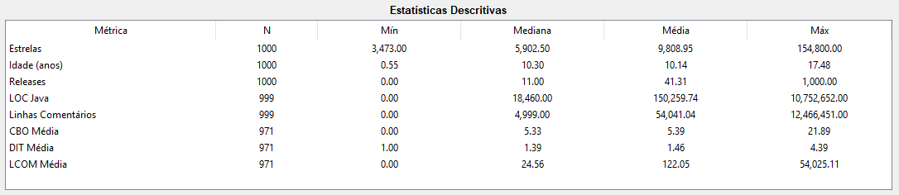
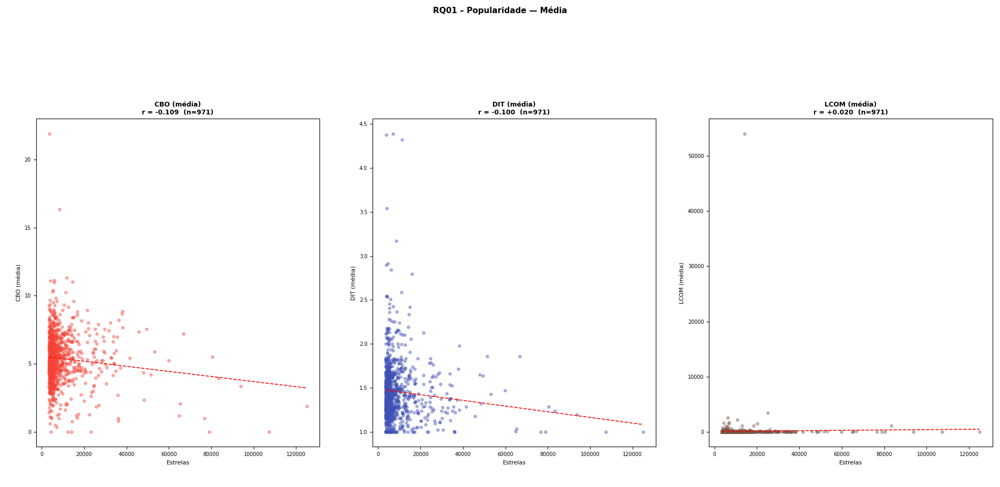
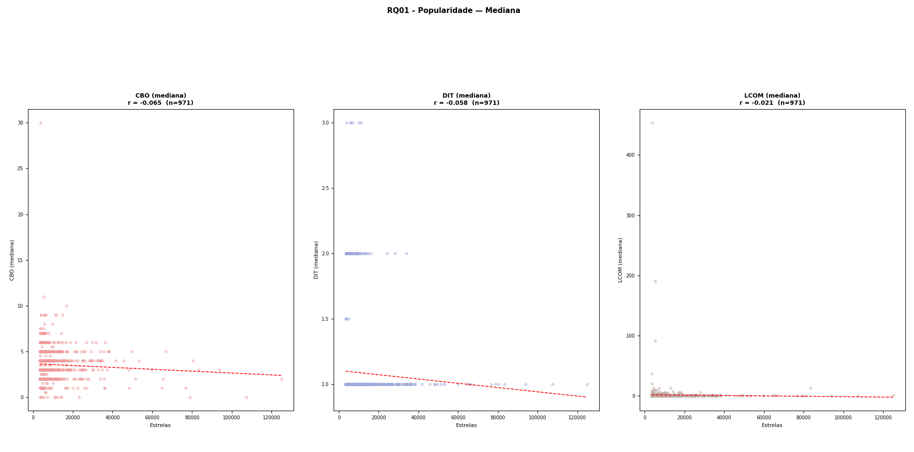
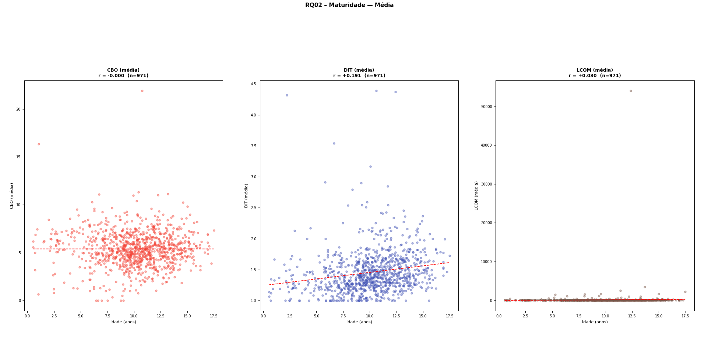
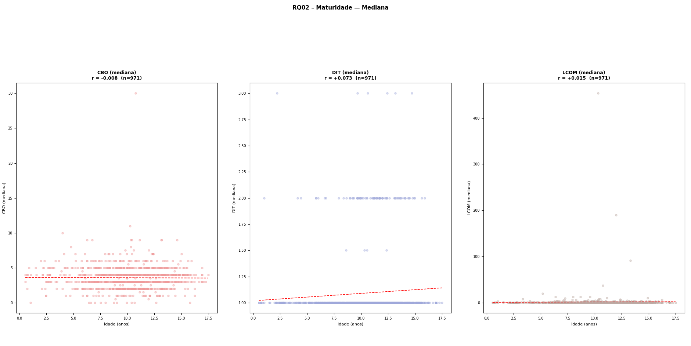
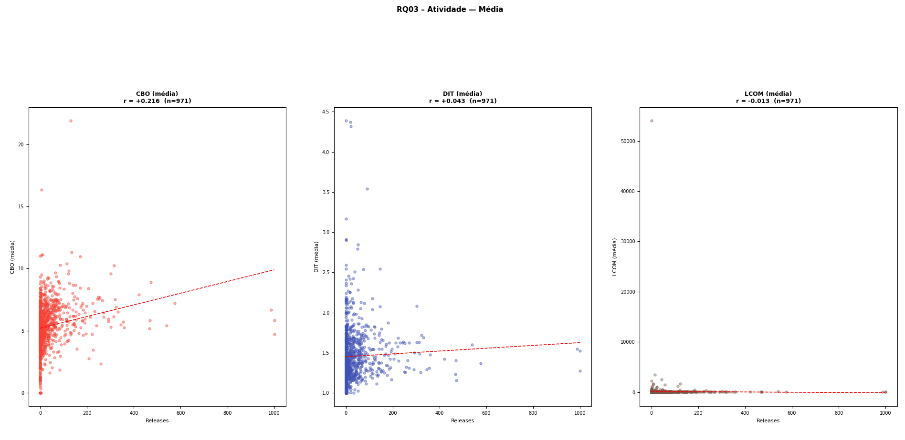
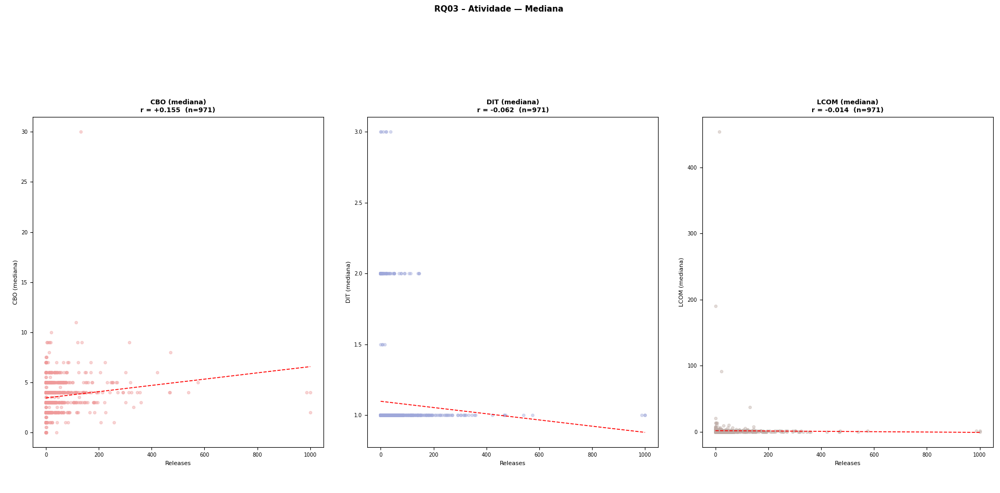
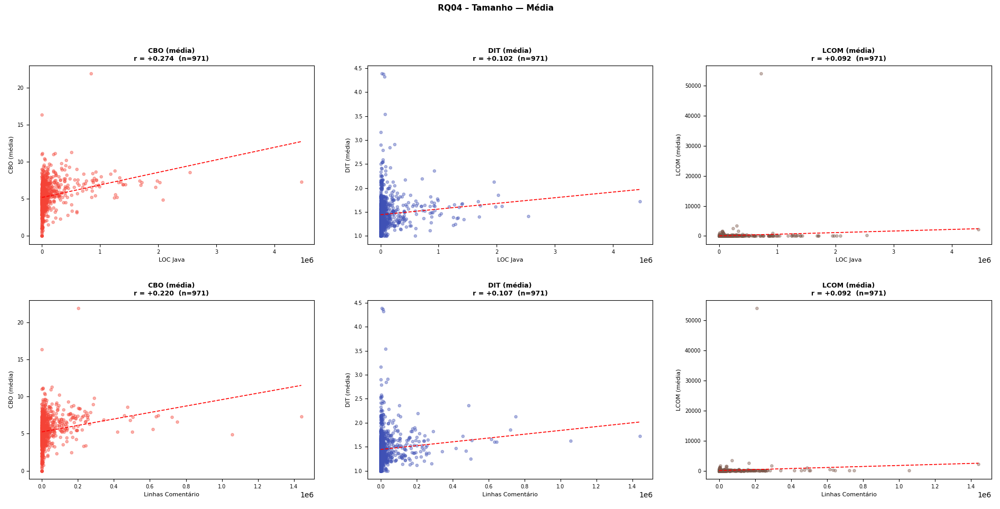
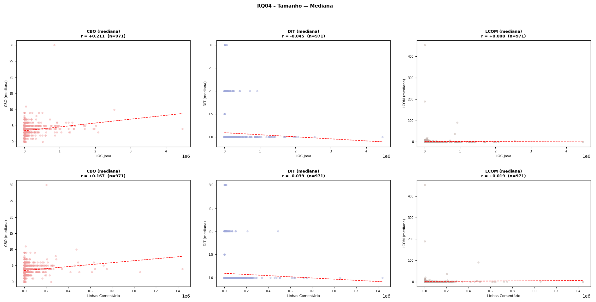
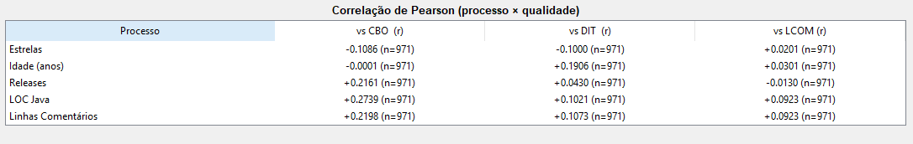

# Relatório de Análise - Qualidade de Repositórios Java Populares do GitHub

**Disciplina**: Experimentação de Software  
**Instituição**: PUCMINAS  
**Período**: 01/2026  
**Autores**: Augusto Fuscaldi Cerezo, Filipe Faria Melo

---

## 1. Introdução

### 1.1 Contextualização

O ecossistema Java é um dos mais consolidados no desenvolvimento de software, sendo amplamente utilizado em sistemas corporativos, aplicações Android, frameworks web e ferramentas de infraestrutura. O GitHub hospeda milhares de repositórios Java populares, muitos dos quais servem como referência de boas práticas para a comunidade. Analisar a qualidade interna desses sistemas , através de métricas de código orientado a objetos , pode revelar padrões relevantes sobre como popularidade, maturidade, atividade e tamanho se relacionam com características de qualidade do código.

### 1.2 Problema Foco do Experimento

Existe uma pergunta em aberto no contexto da Engenharia de Software empírica: projetos populares, maduros ou maiores necessariamente possuem melhor qualidade interna de código? Métricas como acoplamento (CBO), profundidade de herança (DIT) e coesão (LCOM) capturam aspectos estruturais do código que impactam manutenibilidade e testabilidade. Este estudo busca investigar se há relação mensurável entre essas métricas de qualidade e características do processo de desenvolvimento dos repositórios Java mais populares do GitHub.

### 1.3 Questões de Pesquisa

- **RQ01**: Qual a relação entre a **popularidade** dos repositórios e as suas características de qualidade?
- **RQ02**: Qual a relação entre a **maturidade** dos repositórios e as suas características de qualidade?
- **RQ03**: Qual a relação entre a **atividade** dos repositórios e as suas características de qualidade?
- **RQ04**: Qual a relação entre o **tamanho** dos repositórios e as suas características de qualidade?

### 1.4 Definição de Métricas

**Métricas de Processo:**

| Métrica      | Proxy Utilizado                                     |
| ------------ | --------------------------------------------------- |
| Popularidade | Número de estrelas (stars)                          |
| Maturidade   | Idade em anos desde a criação do repositório        |
| Atividade    | Número de releases publicadas                       |
| Tamanho      | Linhas de código Java (LOC) e linhas de comentários |

**Métricas de Qualidade (extraídas via ferramenta CK):**

| Métrica | Descrição                                                                                                                                                                                        |
| ------- | ------------------------------------------------------------------------------------------------------------------------------------------------------------------------------------------------ |
| CBO     | _Coupling Between Objects_ , número de classes às quais uma classe está acoplada. Valores altos indicam forte dependência e menor facilidade de manutenção.                                      |
| DIT     | _Depth of Inheritance Tree_ , profundidade da hierarquia de herança. Valores altos indicam maior reuso via herança, mas também maior complexidade.                                               |
| LCOM    | _Lack of Cohesion of Methods_ , mede o quanto os métodos de uma classe não compartilham atributos internos. Valores altos indicam baixa coesão e possível necessidade de decomposição da classe. |

Para cada repositório, são calculadas a **média** e a **mediana** de cada métrica CK entre todas as classes analisadas. A mediana é preferível na análise por ser robusta a outliers.

### 1.5 Hipóteses

**H1 (RQ01)**: Repositórios mais populares tendem a ter maior CBO, pois projetos com muitos usuários costumam ser frameworks ou bibliotecas que oferecem abstrações com alto grau de integração entre componentes.

**H2 (RQ02)**: Repositórios mais maduros tendem a ter menor LCOM, pois projetos com longa história de manutenção tendem a passar por refatorações que melhoram a coesão das classes.

**H3 (RQ03)**: Repositórios com mais releases (maior atividade) tendem a ter menor CBO, pois ciclos de release frequentes podem incentivar boas práticas e redução de dependências.

**H4 (RQ04)**: Repositórios maiores (mais LOC) tendem a ter maior CBO e maior DIT, pois sistemas maiores naturalmente possuem mais componentes interdependentes e hierarquias de herança mais profundas.

### 1.6 Objetivos

**Objetivo Principal**: Investigar empiricamente a relação entre características de processo de desenvolvimento e métricas de qualidade de código nos 1000 repositórios Java mais populares do GitHub.

**Objetivos Específicos**:

- Coletar dados de processo e produto para os 1000 repositórios Java mais estrelados
- Extrair métricas CK (CBO, DIT, LCOM) via análise estática do código-fonte
- Calcular correlações de Pearson entre métricas de processo e qualidade
- Comparar médias e medianas para identificar influência de outliers
- Validar ou refutar as hipóteses formuladas com base em evidências empíricas

---

## 2. Metodologia

### 2.1 Passo a Passo do Experimento

**Etapa 1 , Planejamento**:

1. Definição das questões de pesquisa (RQ01–RQ04)
2. Identificação das métricas de processo e qualidade
3. Formulação de hipóteses

**Etapa 2 , Coleta de Dados da API**:

1. Autenticação na API GraphQL v4 do GitHub usando token pessoal
2. Query dos repositórios com `language:Java sort:stars-desc`
3. Paginação de 10 repositórios por requisição com cursor
4. Repaginação automática por filtro `stars:<min` quando a paginação esgota
5. Deduplicação por nome completo entre páginas
6. Delay de 0,5s entre requisições para respeitar rate limiting

**Etapa 3 , Extração de Métricas de Código**:

1. Para cada repositório: sparse checkout (apenas arquivos `.java`)
2. Contagem de LOC via ferramenta `cloc` (fallback para contagem manual)
3. Análise CK: `java -jar ck.jar {repo_dir} true 0 false {out_dir}`
4. Leitura dos arquivos CSV/JSON gerados pelo CK
5. Cálculo de média e mediana de CBO, DIT, LCOM por repositório
6. Remoção do clone local após extração
7. Paralelização com `ThreadPoolExecutor` (4 workers simultâneos)

**Etapa 4 , Processamento e Exportação**:

1. Cálculo de métricas derivadas (idade em anos, dias desde push, percentual de issues)
2. Exportação para CSV com todas as métricas de processo e qualidade

**Etapa 5 , Análise**:

1. Cálculo do coeficiente de correlação de Pearson (r) entre cada par processo × qualidade
2. Comparação de médias vs. medianas para identificar influência de outliers
3. Geração de gráficos de dispersão com linha de tendência
4. Validação das hipóteses com base nos resultados observados

### 2.2 Decisões Metodológicas

**Sparse Checkout**: Em vez de clonar o repositório completo, utiliza-se sparse checkout com `--filter=blob:none` limitado a `**/*.java`. Isso reduz drasticamente o tempo de clone e o uso de disco, além de evitar erros de caminho longo no Windows.

**Timeout do CK**: Repositórios muito grandes (ex.: hazelcast, spring-boot) podem demorar mais de 5 minutos no CK. Foi definido timeout padrão de 120s, após o qual o repositório é ignorado e a coleta segue , as colunas CK ficam vazias para esses casos.

**Média vs. Mediana**: Ambas são reportadas. A mediana é a medida principal por ser robusta a outliers (como repositórios com LCOM extremamente alto). A comparação entre as duas nos gráficos permite diagnosticar distorções causadas por valores extremos.

**Correlação de Pearson**: Escolhida por ser a métrica padrão para medir relações lineares entre variáveis contínuas. Valores próximos de zero indicam ausência de relação linear, sem excluir possíveis relações não-lineares.

**Atividade = Releases**: O número de releases foi escolhido como proxy de atividade por representar entregas formais e versionadas, diferente de `pushedAt` (que pode incluir pushes triviais) ou `pr_count` (que mede contribuições externas, não necessariamente atividade interna).

### 2.3 Materiais Utilizados

**API**: GitHub GraphQL API v4

- Endpoint: `https://api.github.com/graphql`
- Autenticação: Token pessoal com permissão `public_repo`

**Ferramenta de Métricas**: CK (`ck-0.7.1-SNAPSHOT-jar-with-dependencies.jar`)

**Linguagem**: Python 3.12

**Bibliotecas**:

- `requests`: Requisições HTTP/GraphQL
- `subprocess`: Execução de git, cloc e CK
- `concurrent.futures`: Paralelização da fase de clone/medição
- `tkinter` + `matplotlib`: Interface gráfica e visualizações
- `numpy`: Cálculo de correlação de Pearson

**Infraestrutura**:

- Sistema Operacional: Windows 11
- Java no PATH (para execução do CK)
- Git no PATH (para clonagem)

### 2.4 Métricas e suas Unidades

| Métrica                | Unidade           | Fonte                             |
| ---------------------- | ----------------- | --------------------------------- |
| Estrelas               | Contagem          | API GitHub                        |
| Idade                  | Anos (dias / 365) | Calculado a partir de `createdAt` |
| Releases               | Contagem          | API GitHub                        |
| LOC Java               | Linhas de código  | cloc / contagem manual            |
| Linhas de Comentários  | Linhas            | cloc / contagem manual            |
| CBO (média / mediana)  | Adimensional      | CK por repositório                |
| DIT (média / mediana)  | Adimensional      | CK por repositório                |
| LCOM (média / mediana) | Adimensional      | CK por repositório                |

---

## 3. Visualização dos Resultados

### 3.1 Dados Coletados

Total de repositórios analisados: **1000**  
Repositórios com métricas CK válidas: **971**  
Repositórios sem CK (timeout ou falha de clone): **29**

### 3.2 Estatísticas Descritivas

#### Métricas de Processo + Métricas de Qualidade (CK)

| Métrica            | N    | Mín   | Mediana  | Média      | Máx        |
| ------------------ | ---- | ----- | -------- | ---------- | ---------- |
| Estrelas           | 1000 | 3.473 | 5.902,50 | 9.808,95   | 154.800    |
| Idade (anos)       | 1000 | 0,55  | 10,30    | 10,14      | 17,48      |
| Releases           | 1000 | 0     | 11       | 41,31      | 1.000      |
| LOC Java           | 999  | 0     | 18.460   | 150.259,74 | 10.752.652 |
| Linhas Comentários | 999  | 0     | 4.999    | 54.041,04  | 12.466.451 |
| CBO Média          | 971  | 0     | 5,33     | 5,39       | 21,89      |
| DIT Média          | 971  | 1,00  | 1,39     | 1,46       | 4,39       |
| LCOM Média         | 971  | 0     | 24,56    | 122,05     | 54.025,11  |

Destaca-se a grande assimetria nas distribuições: **Releases** (mediana 11, média 41,31), **LOC Java** (mediana 18.460, média 150.259) e especialmente **LCOM** (mediana 24,56, média 122,05) revelam distribuições fortemente assimétricas à direita, com poucos repositórios de valores extremamente altos puxando a média para cima. Isso reforça a importância de usar a mediana como medida central na análise.

---

### 3.3 Método de Análise dos Gráficos

Todas as RQs são analisadas através de **gráficos de dispersão** que relacionam uma métrica de processo (eixo X) com uma métrica de qualidade (eixo Y). Cada ponto representa um repositório. Os elementos visuais presentes em cada gráfico são:

- **Pontos coloridos** - cada ponto é um repositório com ambas as métricas disponíveis
- **Linha tracejada vermelha** - linha de regressão linear, indicando a tendência geral da relação
- **`r = valor`** - coeficiente de correlação de Pearson entre as duas variáveis
- **`n = valor`** - número de repositórios com dados válidos para aquele par (pode ser menor que 1000 quando o CK falhou ou deu timeout)

#### Coeficiente de Correlação de Pearson (r)

O coeficiente de Pearson mede o grau e a direção de uma **relação linear** entre duas variáveis. Seu valor varia sempre entre **-1** e **+1**:

| Valor de \|r\| | Classificação          |
| -------------- | ---------------------- |
| 0,00 – 0,19    | Correlação desprezível |
| 0,20 – 0,39    | Correlação fraca       |
| 0,40 – 0,59    | Correlação moderada    |
| 0,60 – 0,79    | Correlação forte       |
| 0,80 – 1,00    | Correlação muito forte |

O **sinal** indica a direção: valores **positivos** indicam que as variáveis crescem juntas; valores **negativos** indicam que uma cresce enquanto a outra diminui.

> **Importante:** correlação não implica causalidade. Um `r` próximo de zero indica ausência de relação _linear_, mas não exclui relações não-lineares.

#### Média vs. Mediana

Cada RQ é apresentada em duas versões, uma usando a **média** das métricas CK por repositório e outra usando a **mediana**. A comparação entre as duas permite diagnosticar a influência de outliers:

- Se os coeficientes `r` forem similares nas duas versões → os outliers têm pouco impacto na análise
- Se os coeficientes divergirem significativamente → a média está sendo distorcida por valores extremos, e a mediana é a medida mais confiável

---

### 3.4 RQ01 - Popularidade × Qualidade

> _Estrelas como proxy de popularidade. Eixo X: número de estrelas. Eixo Y: CBO / DIT / LCOM._

**Correlações de Pearson observadas:**

| Par             | r (usando média) | r (usando mediana) | n   |
| --------------- | ---------------- | ------------------ | --- |
| Estrelas × CBO  | -0.109           | -0.065             | 971 |
| Estrelas × DIT  | -0.100           | -0.058             | 971 |
| Estrelas × LCOM | 0.020            | -0.021             | 971 |

---

### 3.5 RQ02 - Maturidade × Qualidade

> _Idade em anos como proxy de maturidade. Eixo X: idade (anos). Eixo Y: CBO / DIT / LCOM._

**Correlações de Pearson observadas:**

| Par          | r (usando média) | r (usando mediana) | n   |
| ------------ | ---------------- | ------------------ | --- |
| Idade × CBO  | 0                | -0.008             | 971 |
| Idade × DIT  | 0.191            | 0.073              | 971 |
| Idade × LCOM | 0.030            | 0.015              | 971 |

---

### 3.6 RQ03 - Atividade × Qualidade

> _Número de releases como proxy de atividade. Eixo X: releases. Eixo Y: CBO / DIT / LCOM._

**Correlações de Pearson observadas:**

| Par             | r (usando média) | r (usando mediana) | n   |
| --------------- | ---------------- | ------------------ | --- |
| Releases × CBO  | 0.216            | 0.155              | 971 |
| Releases × DIT  | 0.043            | -0.062             | 971 |
| Releases × LCOM | -0.013           | -0.014             | 971 |

---

### 3.7 RQ04 - Tamanho × Qualidade

> _LOC e linhas de comentários como proxies de tamanho. Eixo X: LOC / comentários. Eixo Y: CBO / DIT / LCOM._

**Correlações de Pearson observadas:**

| Par                | r (usando média) | r (usando mediana) | n   |
| ------------------ | ---------------- | ------------------ | --- |
| LOC × CBO          | 0.274            | 0.211              | 971 |
| LOC × DIT          | 0.102            | -0.045             | 971 |
| LOC × LCOM         | 0.092            | 0.008              | 971 |
| Comentários × CBO  | 0.220            | 0.167              | 971 |
| Comentários × DIT  | 0.107            | -0.039             | 971 |
| Comentários × LCOM | 0.092            | 0.019              | 971 |

---

## 4. Discussão dos Resultados

### 4.1 RQ01: Popularidade × Qualidade

**Hipótese**: Repositórios mais populares tendem a ter maior CBO por serem frameworks/bibliotecas com alto grau de integração entre componentes.

**Resultado Observado**: As correlações entre número de estrelas e todas as métricas de qualidade foram **desprezíveis** (|r| < 0,11), com tendências ligeiramente negativas para CBO e DIT.

| Par             | r (média) | r (mediana) | Classificação |
| --------------- | --------- | ----------- | ------------- |
| Estrelas × CBO  | -0,109    | -0,065      | Desprezível   |
| Estrelas × DIT  | -0,100    | -0,058      | Desprezível   |
| Estrelas × LCOM | +0,020    | -0,021      | Desprezível   |

**Análise**:

A hipótese foi **refutada**. Esperava-se que repos populares, por serem tipicamente frameworks e bibliotecas amplamente integradas, apresentassem maior CBO. Contudo, os dados mostram o oposto: há uma leve tendência negativa entre popularidade e acoplamento, sugerindo que os projetos mais estrelados podem ter, na média, classes mais simples e menos dependentes, possivelmente pela maturidade das suas arquiteturas.

Os valores próximos de zero para LCOM (r=+0,020 e r=-0,021 com mediana) indicam ausência total de relação linear entre popularidade e coesão das classes. A comparação entre médias e medianas mostra reduções moderadas nos coeficientes ao usar a mediana (ex.: CBO vai de -0,109 para -0,065), indicando que outliers de CBO elevado presentes em repos de baixa estrela inflam levemente a correlação negativa, mas a conclusão se mantém: **a popularidade não prediz a qualidade estrutural do código**.

---

### 4.2 RQ02: Maturidade × Qualidade

**Hipótese**: Repositórios mais maduros tendem a ter menor LCOM, pois projetos com longa história de manutenção tendem a passar por refatorações que melhoram a coesão.

**Resultado Observado**: As correlações foram **desprezíveis** para CBO e LCOM. O DIT apresentou a correlação positiva mais expressiva desta RQ com a média (r=+0,191), porém cai para desprezível com a mediana (r=+0,073).

| Par          | r (média) | r (mediana) | Classificação |
| ------------ | --------- | ----------- | ------------- |
| Idade × CBO  | 0,000     | -0,008      | Desprezível   |
| Idade × DIT  | +0,191    | +0,073      | Desprezível   |
| Idade × LCOM | +0,030    | +0,015      | Desprezível   |

**Análise**:

A hipótese foi **refutada**. Não há evidência de que repositórios mais maduros possuam menor LCOM, a correlação de r=+0,030 (média) e +0,015 (mediana) é praticamente nula, e na direção oposta ao esperado.

O achado mais interessante desta RQ é o DIT: a correlação de r=+0,191 com a média sugere que repositórios mais antigos tendem a ter hierarquias de herança ligeiramente mais profundas. Uma hipótese explicativa é que projetos com muitos anos de evolução acumulam mais camadas de herança ao longo do tempo, à medida que novas funcionalidades são adicionadas estendendo classes existentes. No entanto, ao usar a mediana (r=+0,073), esse efeito se reduz consideravelmente, indicando que a relação é fortemente influenciada por outliers, repositórios muito antigos com DIT excepcionalmente alto, e não é uma tendência robusta na população geral.

Para CBO, a correlação é exatamente 0,000 com a média e -0,008 com a mediana, confirmando que **maturidade e acoplamento são métricas completamente independentes** nos dados analisados.

---

### 4.3 RQ03: Atividade × Qualidade

**Hipótese**: Repositórios com mais releases tendem a ter menor CBO, pois ciclos de release frequentes podem incentivar boas práticas e redução de dependências.

**Resultado Observado**: O CBO apresentou correlação **fraca positiva** com releases (r=+0,216 na média, r=+0,155 na mediana). DIT e LCOM mostraram correlações desprezíveis, com DIT inclusive invertendo o sinal entre média e mediana.

| Par             | r (média) | r (mediana) | Classificação                         |
| --------------- | --------- | ----------- | ------------------------------------- |
| Releases × CBO  | +0,216    | +0,155      | Fraca (média) / Desprezível (mediana) |
| Releases × DIT  | +0,043    | -0,062      | Desprezível                           |
| Releases × LCOM | -0,013    | -0,014      | Desprezível                           |

**Análise**:

A hipótese foi **refutada**. Ao invés de menor CBO, repositórios mais ativos tendem a apresentar CBO levemente maior. A explicação mais plausível é que projetos com muitas releases são, em geral, sistemas maiores e mais complexos , frameworks ou bibliotecas amplamente utilizadas que naturalmente possuem mais integrações entre componentes. Ou seja, a atividade é um proxy indireto de maturidade e complexidade sistêmica, e não de disciplina de desenvolvimento.

Esta é a única RQ que apresenta uma correlação classificável como "fraca" (r=+0,216), ainda que ao utilizar a mediana o valor caia para o patamar desprezível (r=+0,155). A divergência de sinal no DIT (média +0,043, mediana -0,062) é um indicativo claro de que outliers estão distorcendo o resultado , não há relação confiável entre atividade e profundidade de herança.

Para LCOM, a correlação é praticamente nula em ambas as versões (-0,013 e -0,014), confirmando que a frequência de releases **não tem relação com a coesão das classes**.

---

### 4.4 RQ04: Tamanho × Qualidade

**Hipótese**: Repositórios maiores (mais LOC) tendem a ter maior CBO e maior DIT, pois sistemas maiores possuem mais componentes interdependentes e hierarquias de herança mais profundas.

**Resultado Observado**: O CBO apresentou a correlação mais forte de todo o estudo com LOC (r=+0,274, fraca positiva). DIT e LCOM mostraram correlações desprezíveis, com DIT invertendo o sinal ao usar a mediana , indicativo de forte influência de outliers.

| Par                | r (média) | r (mediana) | Classificação                         |
| ------------------ | --------- | ----------- | ------------------------------------- |
| LOC × CBO          | +0,274    | +0,211      | Fraca                                 |
| LOC × DIT          | +0,102    | -0,045      | Desprezível                           |
| LOC × LCOM         | +0,092    | +0,008      | Desprezível                           |
| Comentários × CBO  | +0,220    | +0,167      | Fraca (média) / Desprezível (mediana) |
| Comentários × DIT  | +0,107    | -0,039      | Desprezível                           |
| Comentários × LCOM | +0,092    | +0,019      | Desprezível                           |

**Análise**:

A hipótese foi **parcialmente confirmada apenas para CBO**. A relação entre LOC e CBO (r=+0,274) é a correlação mais forte observada em todo o estudo e se mantém robusta ao usar a mediana (r=+0,211) , o que indica que o tamanho do repositório é o preditor mais confiável de acoplamento entre as variáveis investigadas. Isso faz sentido estruturalmente: sistemas maiores naturalmente possuem mais classes, e mais classes aumentam as oportunidades , e a necessidade , de dependências entre componentes.

Contudo, para o DIT a hipótese não se confirma. A correlação com a média é modesta (+0,102 para LOC), mas ao usar a mediana o valor inverte para -0,045, revelando que a relação observada é espúria e dirigida por outliers. Repositórios com DIT extremamente alto não são necessariamente os maiores em LOC.

Para LCOM, o mesmo padrão se repete: correlação desprezível com a média e essencialmente nula com a mediana (+0,008 para LOC × LCOM). O tamanho do código não prediz a coesão das classes.

A semelhança entre os resultados de LOC e Linhas de Comentários era esperada, dado que as duas métricas são altamente correlacionadas entre si (projetos maiores produzem mais código e mais comentários). A consistência dos resultados confirma que o achado principal desta RQ , **tamanho prediz acoplamento fracamente, mas não herança nem coesão** , é robusto.

---

**Limitações do Estudo**:

1. **Timeout do CK**: Repositórios muito grandes tiveram o CK interrompido por timeout, gerando ausência de métricas de qualidade para uma fração dos repos. Isso pode introduzir viés de seleção , os repos sem CK tendem a ser justamente os maiores.

2. **Correlação linear**: O coeficiente de Pearson mede apenas relação linear. Relações não-lineares entre tamanho e qualidade, por exemplo, não seriam capturadas.

3. **Agregação por repositório**: CBO, DIT e LCOM são calculados por classe e depois agregados (média/mediana) por repositório. Essa agregação perde informação sobre a distribuição interna de qualidade dentro de cada sistema.

4. **Apenas arquivos `.java`**: O sparse checkout exclui outras linguagens presentes no repositório, o que pode subestimar LOC em projetos multilinguagem.

5. **Snapshot temporal**: Os dados representam um único momento no tempo. A qualidade de código pode variar significativamente ao longo do ciclo de vida do projeto.

6. **Causalidade**: Correlações encontradas não implicam causalidade. Um CBO elevado em repos populares pode ser consequência da popularidade (mais contribuições, mais acoplamento) ou de seu tipo (frameworks naturalmente mais acoplados).

---

## 5. Conclusão

**Introdução**

A análise dos 971 repositórios Java com métricas CK válidas revelou que a relação entre características de processo e qualidade de código é, em geral, **desprezível a fraca**. Os coeficientes de Pearson obtidos variaram entre r=0,000 e r=+0,274, indicando que nenhuma das métricas de processo investigadas , popularidade, maturidade, atividade ou tamanho , é um preditor forte da qualidade estrutural do código. O único relacionamento classificado como "fraco" é entre LOC e CBO (r=+0,274), e mesmo esse resultado, embora o mais robusto do estudo, explica menos de 8% da variância observada no acoplamento.

---

**Achados por RQ**

| RQ   | Métrica de Processo | Qualidade mais correlacionada | r (mediana) | Hipótese                |
| ---- | ------------------- | ----------------------------- | ----------- | ----------------------- |
| RQ01 | Estrelas            | CBO                           | -0,065      | Refutada                |
| RQ02 | Idade (anos)        | DIT                           | +0,073      | Refutada                |
| RQ03 | Releases            | CBO                           | +0,155      | Refutada                |
| RQ04 | LOC Java            | CBO                           | +0,211      | Parcialmente Confirmada |

---

**Impacto dos Outliers**

A comparação entre os gráficos de média e mediana revelou distorções significativas em diversas métricas. O caso mais expressivo é o **LCOM**: com média de 122,05 e mediana de 24,56 , uma razão de quase 5:1 ,, a distribuição é dominada por poucos repositórios com coesão extremamente baixa (máx. 54.025). Isso faz com que qualquer correlação calculada com a média de LCOM seja pouco confiável.

O **DIT** também sofre influência relevante de outliers: em RQ02, a correlação com a média é +0,191 (limiar de "fraca"), mas cai para +0,073 com a mediana. Em RQ04, o coeficiente inverte de sinal (+0,102 vs. -0,045). Esses casos ilustram por que a mediana foi adotada como medida principal neste estudo.

O **CBO** mostrou-se a métrica mais estável: as correlações calculadas com média e mediana foram sempre na mesma direção e com magnitudes próximas, o que confere mais confiança aos resultados envolvendo essa métrica.

---

**Resumo**

Os resultados contradizem a intuição de que repositórios mais populares, maduros, ativos ou maiores necessariamente possuem melhor qualidade estrutural de código , ao menos conforme mensurada por CBO, DIT e LCOM. O achado de maior significância prática é que **repositórios maiores tendem a ter maior acoplamento entre objetos** (LOC × CBO, r=+0,274), o que é esperado pela complexidade inerente a sistemas grandes, mas ainda assim classifica-se apenas como correlação fraca.

A ausência de correlações fortes pode ter múltiplas explicações: a qualidade de código pode ser determinada mais por fatores culturais e de processo (estilo de arquitetura, práticas da equipe, domínio da aplicação) do que por características observáveis via API do GitHub. Adicionalmente, a agregação das métricas CK por repositório oculta a heterogeneidade interna , um mesmo sistema pode ter classes muito bem escritas e outras extremamente acopladas, e a média ou mediana apaga essa distinção.

Os resultados devem ser interpretados com cautela pelas limitações já apontadas , especialmente o viés introduzido pelo timeout do CK nos 29 repositórios mais pesados e a natureza estática da análise. Ainda assim, os dados fornecem evidências empíricas relevantes: **para os 1000 repositórios Java mais populares do GitHub, as métricas de processo analisadas não são preditoras confiáveis da qualidade estrutural do código**.

---

### 5.1 Tomada de Decisão

**Decisões Chave**:

- **Popularidade**: número de estrelas como proxy
- **Maturidade**: idade em anos (calculada a partir de `createdAt`)
- **Atividade**: número de releases (entregas formais versionadas)
- **Tamanho**: LOC Java e linhas de comentários via `cloc`
- **Qualidade**: métricas CK (CBO, DIT, LCOM) , média e mediana por repositório
- **Correlação**: coeficiente de Pearson com comparação média vs. mediana
- **Clone**: sparse checkout apenas de `.java` para eficiência e compatibilidade Windows
- **Timeout CK**: 120s por repositório, ignorado em caso de estouro
- **Paralelismo**: 4 workers simultâneos para clone + CK
- **Ferramenta**: Python 3.12 + CK 0.7.1 + GUI tkinter/matplotlib

---

### 5.2 Sugestões Futuras

**Dados Adicionais**:

- Coletar número de contribuidores únicos por repositório como métrica adicional de atividade
- Incluir cobertura de testes (via JaCoCo ou similar) como métrica complementar de qualidade
- Analisar complexidade ciclomática (WMC) disponível no CK, além de CBO/DIT/LCOM

**Novos Indicadores**:

- Analisar evolução temporal das métricas CK ao longo do histórico de commits
- Comparar qualidade entre repositórios de diferentes domínios (frameworks, aplicações, bibliotecas)
- Incluir métricas de processo mais granulares, como frequência de commits por período

**Metodologia**:

- Aumentar o timeout do CK para repositórios acima de determinado limiar de LOC, evitando perda de dados para os maiores sistemas
- Realizar coleta longitudinal (snapshots periódicos) para capturar evolução da qualidade ao longo do tempo
- Estratificar análise por domínio de aplicação (ex.: frameworks vs. ferramentas vs. aplicações)
